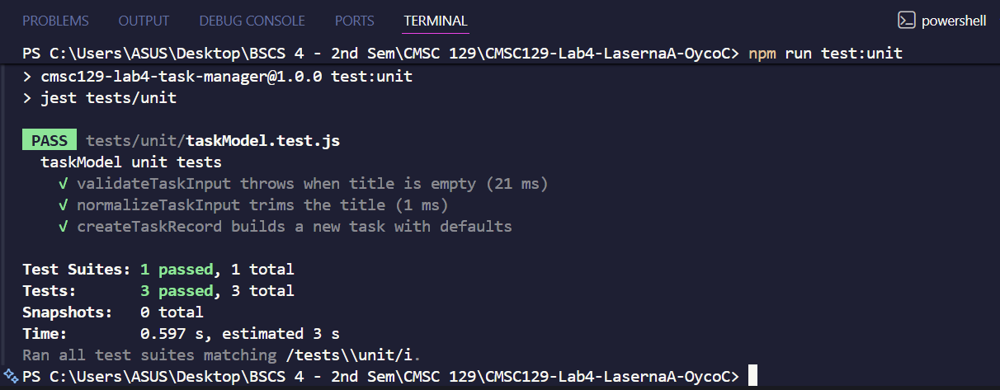
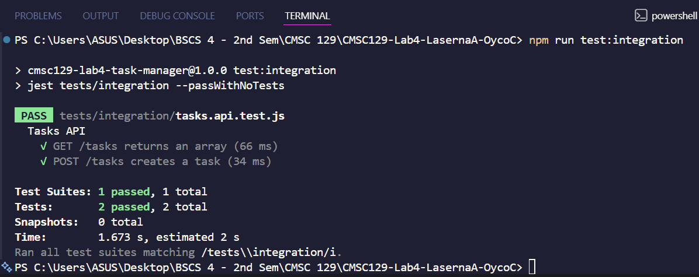
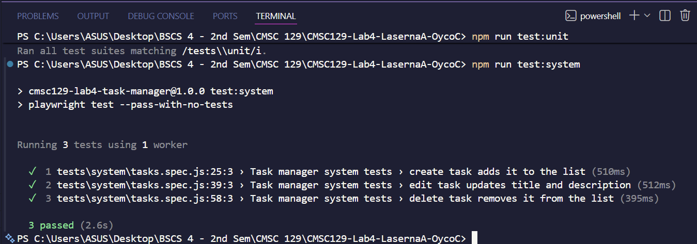
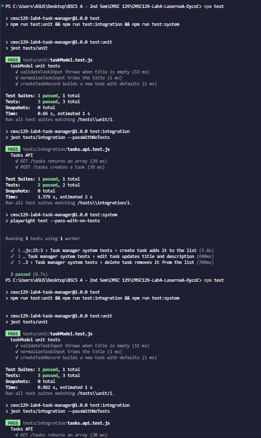
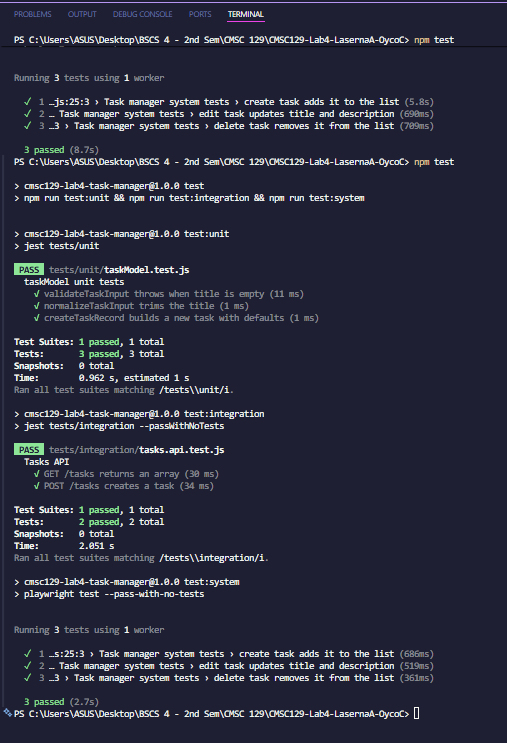

# CMSC129-Lab4-LasernaA-OycoC

## App Description
A simple task manager web app that lets users create, edit, and delete tasks. The app uses a React frontend and an Express API, with an in-memory data store (no database) to keep the focus on test-driven development.

## User Stories
- As a user, I want to create a task so that I can track new work.
- As a user, I want to edit a task so that I can keep task details up to date.
- As a user, I want to delete a task so that I can remove completed or unwanted tasks.

## Tech Stack
- Frontend: React (Vite)
- Backend: Node.js + Express
- Unit tests: Jest
- Integration tests: Jest + Supertest
- System tests: Playwright
- Data storage: In-memory array (no database)

## Testing Strategy
- Unit: Pure task logic (validation, transformations, ID handling) with no HTTP or browser.
- Integration: Express routes + handlers + task logic working together via real HTTP requests.
- System: Full user journeys in a real browser aligned to the user stories.

## Setup Instructions
- Clone the repository.
- Install dependencies with npm at the project root.
- Start dev servers and run tests using the scripts documented below.

## Test Results
- Unit tests:

- Integration tests:

- System tests:

- Full suite:

## CI/CD Setup
- Tool: GitHub Actions
- Trigger: Push to main
- Behavior: Run unit, integration, and system tests on every push
- Evidence: Screenshots of failing [RED] pipeline runs pending

## Deployment
- Target: Render (single service: Express serves the built React frontend)
- Docker: Multi-stage build to produce a production-ready image

## Reflection
- TDD helped keep the API, UI, and tests aligned through each phase.
- System tests surfaced UI gaps early and clarified required user flows.
- Incremental commits made it easier to recover when tests failed.
- Keeping the backend in-memory simplified debugging and iteration speed.
